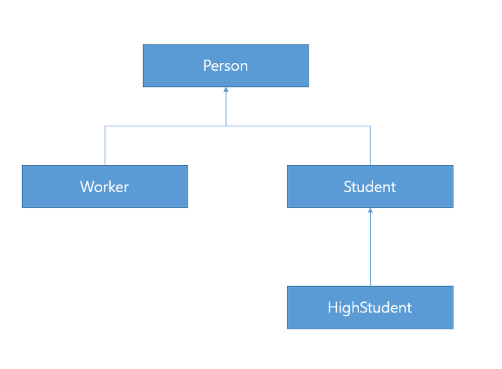

# raw type은 사용하지 마라

### 제네릭

제네릭은 jdk1.5 부터 사용할 수 있다. 
제네릭을 지원하기 전에는 컬렉션에서 객체를 꺼낼 때 마다 형변환을 해야 했다. 
1.5 부터는 제네릭을 사용하면 컬렉션에 담을 수 있는 타입을 컴파일러에게 알려주며, 
컴파일러가 알아서 형변환 코드를 추가한다. 
또한 엉뚱한 객체를 넣는 코드가 있다면 컴파일 타임에 차단해준다.

### raw type이란?

클래스와 인터페이스 선언에 타입 매개변수(ex. <E>)가 있으면 각각 제네릭 클래스, 제네릭 인터페이스라고 부른다. 
이것을 제네릭 타입이라고 한다. (ex. List<E>) 제네릭 타입을 정의하면 raw type도 정의되는데, 
여기서 List<E>의 무인자 자료형(raw type)이란 List 이다. 즉, 타입 매개변수를 쓰지 않은 경우를 말한다. 
이것은 제네릭이 도입되기 전 코드와 호환성을 맞추기 위한 것이다.

### raw type의 사용 비추천

오류의 발견은 컴파일 타임에 되는게 가장 이상적이다. 
raw type을 사용할 경우, unchecked 경고가 나오며, 잘못된 타입을 add 할 수도 있다. 
이것은 런타임에서 문제가 생길 것이다. (ClassCastException 등) 따라서 raw type을 쓰지말고, 
제네릭 타입을 쓴다면 컴파일러의 검사력(정적언어의 장점을 활용)과 타입 불변, 안정성을 얻을 수 있다.

```java
private final Collection stamps = ...; // 무인자 컬렉션 자료형 

stamps.add(new Coin( ... )); // 실수로 넣은 Coin 객체 

for (Iterator i = stamps.iterator(); i.hasNext(); ) { 
    Stamp s = (Stamp) i.next(); // ClassCastException 발생 ... 
}
```

위와 같이 무인자 자료형 stamps에 잘못 들어간 Coin 객체 때문에 런타임시 예외가 발생할 수 있다. 

아래와 같이 제네릭을 쓰면, 컴파일러에게 컬렉션에 담길 객체의 자료형이 무엇인지 선언할 수 있다.

```java
// 형인자 컬렉션 자료형 - 형 안전성(typesafe) 확보 
private final Collection<Stamp> stamps = ...;
```

자바와 같은 JVM 언어 중에 코틀린은 제네릭을 쓰지 않으면 컬렉션을 쓰지 못하도록 아예 막아버렸다. 

자바는 하위호환성 때문에 쓰지말라고 권고하면서도 막지 못한 경우이다.

```java
public static void main(String[] args) { 
    List<String> strings = new ArrayList<String>(); 
    unsafeAdd(strings, new Integer(42)); 
    String s = strings.get(0); // 에러 발생 
} 

// 실행 도중 오류를 일으키는 무인자 자료형 예시
private static void unsafeAdd(List list, Object o) { 
    list.add(o); 
}
```

```java
private static void unsafeAdd(List<Object> list, Object o) {
    list.add(o);
}
```

### 와일드 카드?

코드에서 ?를 일반적으로 와일드카드(wildcard)라고 명칭합니다.

- 제네릭 타입<?>: Unbounded Wildcards(제한 없음)

    타입 파라미터를 대치하는 구체적인 타입으로 모든 클래스나 인터페이스 타입이 올 수 있습니다.

- 제네릭 타입<? extends 상위 타입>: Upper Bounded Wildcards(상위 클래스 제한)

    타입 파라미터를 대치하는 구체적인 타입으로 상위 타입이나 하위 타입이 올 수 있습니다.

- 제네릭 타입<? Super 하위 타입>: Lower Bounded Wildcards(하위 클래스 제한)

    타입 파라미터를 대치하는 구체적인 타입으로 하위 타입이나 상위타입이 올 수 있습니다.


아래에 Course 라는 과정 클래스로 과정 이름과 수강생 이름 배열을 저장하고 있습니다.

```java
public class Course<T> {
    private String name;
    private T[] students;
 
    public Course(String name, int capacity) {
        this.name = name;
        students = (T[]) (new Object[capacity]);
    }
 
    public String getName() {
        return name;
    }
 
    public void setName(String name) {
        this.name = name;
    }
 
    public T[] getStudents() {
        return students;
    }
 
    public void setStudents(T[] students) {
        this.students = students;
    }
 
    public void add(T t) {
        for (int i = 0; i < students.length; i++) {
            if (students[i] == null) {
                students[i] = t;
                break;
            }
        }
    }
}
```

수강생이 될 수 있는 타입은 다음 5가지 클래스라고 가정합시다. 
Person의 하위 클래스로 Worker와 Student가 있고, Student의 하위 클래스로 HighStudent가 있습니다.



정리해 보면

- Course<?>

    수강생은 모든 타입(Person, Worker, Student, HighStudent, Dog>이 될 수 있습니다.

- Course<? extends Student>
    
    수강생은 Student와 HighStudent만 될 수 있습니다.

- Course<? super Worker>

수강생은 Worker와 Person만 될 수 있습니다.


### raw type, 와일드 카드 <?> <? extends ...>, <? super ...>, <Object> 의 차이

만약 타입 매개변수를 신경쓰지 않고 사용하고 싶다해도 raw type 보다는 제네릭의 와일드카드를 쓰는 것이 좋다. 
(ex. Set<?>, Set<? extends ...>, Set<? super ...>) 이렇게 하면 어떤 타입도 받을 수 있으면서 안전하며 유연해진다.

이 둘의 차이점은 raw type 은 타입에 안전하지 않으나, 와일드카드는 안전하다.

```java
List rawList = new ArrayList<String>(); // 런타임에는 아무런 타입이 남지 않기 때문에 컴파일 성공 
List<?> wildList = new ArrayList<String>(); // 컴파일 성공 
List<Object> genericList = new ArrayList<String>(); // 컴파일 실패 

rawList.add("redboy"); // 잘 동작한다. 
wildList.add("redboy"); // 제네릭 타입 매개변수에 의존성이 있는데, <?>는 타입을 알지 못하므로 컴파일에 실패한다. 타입 안정성은 되는 셈
wildList.clear(); // 제네릭 타입 매개변수에 의존이 없으므로 동작한다.
```

### 무인자 자료형(raw type)을 그래도 써도 되는경우

첫 번째는 클래스 리터럴(class literal)에는 반드시 무인자 자료형을 사용해야 한다는 것이다. 
클래스 리터럴에는 형인자 자료형을 쓸 수 없다. 

(List.class, String[].class, int.class는 가능하지만 List<String>.class나 List<?>.class는 불가)

두 번째는 instanceOf 연산자 사용규칙이다.
제네릭 자료형 정보는 프로그램이 실행될때는 지워지므로 instanceOf 연산자는 형인자 자료형에 적용할수가없다. 
비한정적 와일드 카드 자료형은 가능하다. 
하지만 코드만 지저분해질뿐 굳이 쓸이유가없다.

```java
if (o instanceof Set){ // 무인자 자료형
    Set<?> m = (Set<?>) 0; // 와일드 카드 자료형
}
```