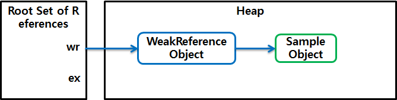

# 다 쓴 객체 참조를 해제하라

이번장에서는 객체 참조방식에 대허서 이야기 하고 있습니다.
아래는 메모리 누수가 일어나는 예제입니다.

```java
package effectivejava.chapter2.item7;
import java.util.*;

// 코드 7-1 메모리 누수가 일어나는 위치는 어디인가? (36쪽)
public class Stack {
    private Object[] elements;
    private int size = 0;
    private static final int DEFAULT_INITIAL_CAPACITY = 16;

    public Stack() {
        elements = new Object[DEFAULT_INITIAL_CAPACITY];
    }

    public void push(Object e) {
        ensureCapacity();
        elements[size++] = e;
    }

    public Object pop() {
        if (size == 0)
            throw new EmptyStackException();
        return elements[--size];
    }

    /**
     * 원소를 위한 공간을 적어도 하나 이상 확보한다.
     * 배열 크기를 늘려야 할 때마다 대략 두 배씩 늘린다.
     */
    private void ensureCapacity() {
        if (elements.length == size)
            elements = Arrays.copyOf(elements, 2 * size + 1);
    }

//    // 코드 7-2 제대로 구현한 pop 메서드 (37쪽)
//    public Object pop() {
//        if (size == 0)
//            throw new EmptyStackException();
//        Object result = elements[--size];
//        elements[size] = null; // 다 쓴 참조 해제
//        return result;
//    }

    public static void main(String[] args) {
        Stack stack = new Stack();
        for (String arg : args)
            stack.push(arg);

        while (true)
            System.err.println(stack.pop());
    }
}

```


###  강한 참조 (Strong Reference)

```java
Integer prime = 1; 
StringBuffer buffer = new StringBuffer();
```  
가장 일반적인 참조 유형이다.    
prime 변수 는 값이 1 인 Integer 객체에 대한 강한 참조 를가진다.  
이 객체를 가리키는 강한 참조가 있는 객체는 GC대상이 되지않는다.

### 부드러운 참조 (Soft Reference)

```java
SoftReference<Integer> soft = new SoftReference<Integer>(prime); 
```

와 같이 SoftReference Class를 이용하여 생성이 가능하다.  
만약 prime == null 상태가 되어 더이상 원본(최초 생성 시점에 이용 대상이 되었던 Strong Reference) 은 없고 대상을 참조하는 객체가 SoftReference만 존재할 경우 GC대상으로 들어가도록 JVM은 동작한다.   
다만 WeakReference 와의 차이점은 메모리가 부족하지 않으면 굳이 GC하지 않는 점이다.  때문에 조금은 엄격하지 않은 Cache Library들에서 널리 사용되는 것으로 알려져있다.

### 약한 참조 (Weak Reference)

```java
WeakReference<Integer> soft = new WeakReference<Integer>(prime);  
``` 

WeakReference Class를 이용하여 생성이 가능하다.  
prime == null 되면 (해당 객체를 가리키는 참조가 WeakReference 뿐일 경우) GC 대상이 된다.  
앞서 이야기 한 내용과 같이 SoftReference와 차이점은 메모리가 부족하지 않더라도 GC 대상이 된다는 것이다.    
다음 GC가 발생하는 시점에 무조건 없어진다.

참조 방식에 대해서 좀더 자세히 알아보면

JVM에서 메모리 영역인 runtime data area는 아래오 같다.


런타임 데이터 영역은 위와 같이 스레드가 차지하는 영역들과, 객체를 생성 및 보관하는 하나의 큰 힙, 클래스 정보가 차지하는 영역인 메서드 영역, 크게 세 부분으로 나눌 수 있다. 위 그림에서 객체에 대한 참조는 화살표로 표시되어 있다.

힙에 있는 객체들에 대한 참조는 다음 4가지 종류 중 하나이다.

- 힙 내의 다른 객체에 의한 참조
- Java 스택, 즉 Java 메서드 실행 시에 사용하는 지역 변수와 파라미터들에 의한 참조
- 네이티브 스택, 즉 JNI(Java Native Interface)에 의해 생성된 객체에 대한 참조
- 메서드 영역의 정적 변수에 의한 참조

이들 중 힙 내의 다른 객체에 의한 참조를 제외한 나머지 3개가 root set으로, reachability 를 판가름하는 기준이 된다.

reachability를 더 자세히 설명하기 위해 root set과 힙 내의 객체를 중심으로 다시 그리면 다음과 같다.


- root set으로부터 시작한 참조 사슬에 속한 객체들은 reachable 객체
- 참조 사슬과 무관한 객체들이 unreachable 객체로 GC 대상

reference
java.lang.ref.WeakReference 클래스는 참조 대상인 객체를 캡슐화(encapsulate)한 WeakReference 객체를 생성하게 된다.
WeakReference 객체는 다른 객체들과 달리 Java GC가 특별하게 취급합니다.

```java
WeakReference<Sample> wr = new WeakReference<Sample>( new Sample());  
Sample ex = wr.get();  
...
ex = null;  
```

위 코드의 첫 번째 줄에서 생성한 WeakReference 클래스의 객체는 new() 메서드로 생성된 Sample 객체를 캡슐화한 객체이다. 
참조된 Sample 객체는 두 번째 줄에서 get() 메서드를 통해 다른 참조에 대입된다. 
이 시점에서는 WeakReference 객체 내의 참조와 ex 참조, 두 개의 참조가 처음 생성한 Sample 객체를 가리킨다.


위 코드의 마지막 줄에서 ex 참조에 null을 대입하면 처음 생성한 Sample 객체는 오직 WeakReference 내부에서만 참조된다. 



기존에는 GC 대상 여부는 reachable인가 unreachable 인가로만 구분하였고 
이를 사용자 코드에서는 관여할 수 없었다. 

그러나 java.lang.ref 패키지를 이용하여 reachable 객체들을 강도별로 구별하여 GC 때의 동작을 다르게 지정할 수 있게 되었다. 
다시 말해, GC 대상 여부를 판별하는 부분에 사용자 코드가 개입할 수 있게 되었다.


- 녹색으로 표시한 중간의 두 객체는 WeakReference로만 참조된 weakly reachable 객체
- 파란색 객체는 strongly reachable 객체
- GC가 동작할 때, unreachable 객체뿐만 아니라 weakly reachable 객체도 가비지 객체로 간주되어 메모리에서 회수된다. 

#### 정리

- Java GC는 GC 대상 객체를 찾고, 대상 객체를 처리(finalization)하고, 할당된 메모리를 회수하는 작업으로 구성된다.
- 애플리케이션은 사용자 코드에서 객체의 reachability를 조절하여 Java GC에 일부 관여할 수 있다.
- 객체의 reachability를 조절하기 위해서 java.lang.ref 패키지의 SoftReference, WeakReference, PhantomReference, ReferenceQueue 등을 사용한다.

### [부록] heap dump 
- [profiler](https://developer.android.com/studio/profile/memory-profiler?hl=ko)